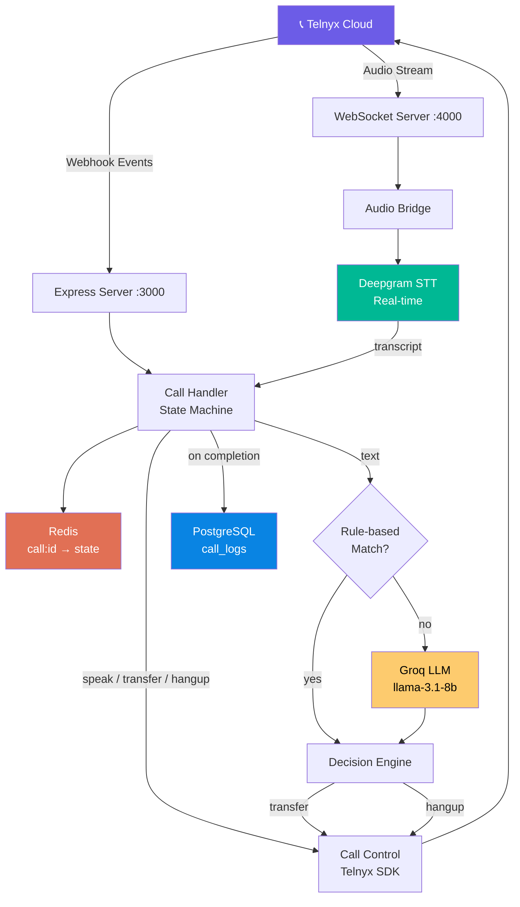
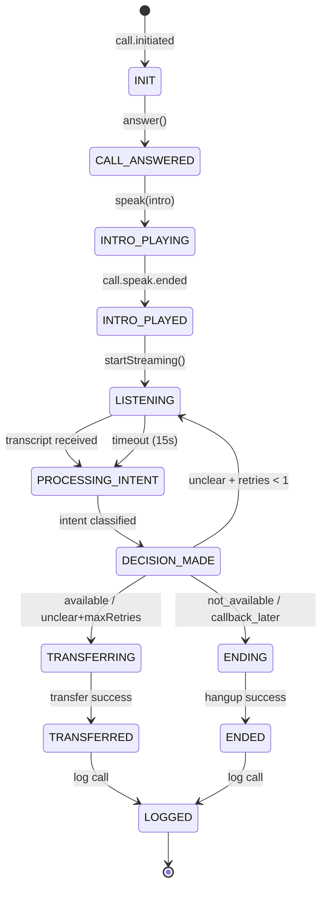

# 🤖 AI Voice Call Agent — SGgarners

A **production-ready AI Voice Call Agent** that handles real-time phone calls via **Telnyx**, classifies caller intent using **Deepgram STT** + **Groq LLM**, and routes calls intelligently.

---

## Architecture

```
📞 Telnyx (Call Control)
   ↓ Webhook Events          ↓ Audio Stream (WSS)
┌──────────────────────────────────────────────────┐
│  Node.js Backend (Express + WebSocket)           │
│                                                  │
│  ┌──────────────┐    ┌──────────────────────┐   │
│  │ Webhook       │    │ Audio Bridge (WSS)    │   │
│  │ Handler       │    │  → Deepgram STT       │   │
│  └──────┬───────┘    └──────────┬───────────┘   │
│         ↓                       ↓                │
│  ┌──────────────────────────────────────────┐   │
│  │  Call Handler (State Machine)             │   │
│  │  Redis: call:{id} → {state, intent, ...}  │   │
│  └──────┬───────────────────────┬───────────┘   │
│         ↓                       ↓                │
│  ┌─────────────┐    ┌───────────────────────┐   │
│  │ Intent       │    │ Decision Engine        │   │
│  │ Rule + Groq  │    │ intent → action        │   │
│  └─────────────┘    └───────────────────────┘   │
│         ↓                                        │
│  ┌──────────────────────────────────────────┐   │
│  │  PostgreSQL — call_logs (analytics)       │   │
│  └──────────────────────────────────────────┘   │
└──────────────────────────────────────────────────┘
```

---

## Architecture Diagram



## State Machine Diagram



## Quick Start

### 1. Prerequisites

- **Node.js** >= 18
- **Redis** running on `localhost:6379`
- **PostgreSQL** running on `localhost:5432`
- **ngrok** installed (for Telnyx webhooks in dev)
- API keys for: Telnyx, Deepgram, Groq

### 2. Install

```bash
npm install
```

### 3. Configure

```bash
# Copy the example env and fill in your keys
cp .env.example .env
```

Edit `.env` with your API keys. Required fields:
- `TELNYX_API_KEY`
- `TELNYX_CONNECTION_ID` (from Telnyx dashboard → Connections)
- `DEEPGRAM_API_KEY`
- `GROQ_API_KEY`
- `TRANSFER_NUMBER` (human agent phone number)

### 4. Setup Database

```bash
# Create the database first (in psql):
# CREATE DATABASE callbot;

# Then run migrations:
npm run migrate
```

### 5. Start the Server

```bash
npm run dev
```

### 6. Expose with ngrok

In a separate terminal:

```bash
ngrok http 3000
```

Copy the `https://` URL from ngrok output.

### 7. Configure Telnyx

1. Go to **Telnyx Dashboard** → **Voice** → your Connection
2. Set **Webhook URL** to: `https://<ngrok-url>/webhook`
3. Note your **Connection ID** and add it to `.env`

### 8. Set Stream URL

Add to your `.env`:
```
STREAM_URL=wss://<ngrok-url>/audio
```

Then restart the server.

---

## API Endpoints

| Method | Path | Description |
|--------|------|-------------|
| `POST` | `/webhook` | Telnyx webhook handler (auto-called) |
| `POST` | `/calls/outbound` | Initiate an outbound call |
| `GET`  | `/health` | System health check |

### Outbound Call Example

```bash
curl -X POST http://localhost:3000/calls/outbound \
  -H "Content-Type: application/json" \
  -d '{"to": "+1234567890"}'
```

---

## Call Flow

```
1. Call arrives (inbound) or initiated (outbound)
2. System answers → plays intro TTS
3. Audio streams to Deepgram for real-time transcription
4. Transcript classified: rule-based → Groq fallback
5. Decision engine routes:
   • Available → "Connecting you..." → Transfer
   • Not available → "Goodbye" → Hangup
   • Callback later → "We'll call back" → Hangup
   • Unclear → Ask once more → Transfer to human
6. Call logged to PostgreSQL
```

---

## State Machine

```
INIT → ANSWERING → INTRO_PLAYING → LISTENING
  → PROCESSING_INTENT → DECISION_MADE → RESPONDING
  → TRANSFERRING → ENDED → LOGGED
  → ENDING → ENDED → LOGGED
```

---

## Project Structure

```
├── server.js                     # Entry point
├── src/
│   ├── config/
│   │   ├── index.js              # Environment config
│   │   └── database.js           # PostgreSQL pool
│   ├── handlers/
│   │   └── callHandler.js        # State machine (core brain)
│   ├── middleware/
│   │   └── webhookValidator.js   # Telnyx signature check
│   ├── routes/
│   │   └── webhook.js            # API routes
│   ├── services/
│   │   ├── audioBridge.js        # WebSocket audio handler
│   │   ├── callControl.js        # Telnyx API wrapper
│   │   ├── decisionEngine.js     # Intent → action logic
│   │   ├── intent.js             # Rule-based + Groq classifier
│   │   ├── logger.js             # PostgreSQL logging
│   │   ├── redis.js              # Call state management
│   │   └── stt.js                # Deepgram STT
│   └── utils/
│       ├── constants.js          # States, intents, messages
│       ├── errors.js             # Custom error classes
│       └── log.js                # Structured logging
├── scripts/
│   └── migrate.js                # Database setup
├── .env                          # Environment variables
├── .env.example                  # Template
└── package.json
```

---

## Troubleshooting

| Issue | Solution |
|-------|----------|
| Webhook not receiving events | Check ngrok is running and URL is set in Telnyx dashboard |
| Audio not streaming | Verify `STREAM_URL` in `.env` matches your ngrok WSS URL |
| STT not working | Check Deepgram API key and encoding settings (mulaw/8000) |
| Transfer fails | Verify `TRANSFER_NUMBER` format (+country code) |
| DB connection error | Ensure PostgreSQL is running and `callbot` database exists |

---

## License

MIT
