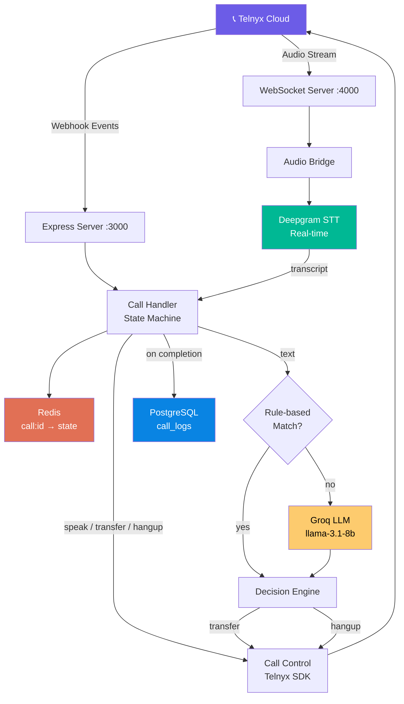
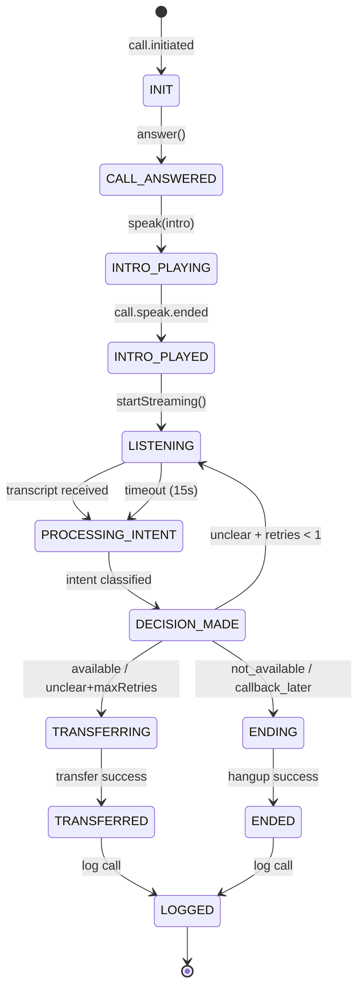

# AI Voice Call Agent — Implementation Plan

## Overview

Build a **production-ready AI Voice Call Agent** using Telnyx for telephony, Deepgram for real-time STT, Groq for intent classification, Redis for call state management, and PostgreSQL for call logging.

The system acts as a **smart call routing assistant** — not a chatbot. It answers/initiates calls, plays an intro, listens for a short response, classifies intent, then transfers or hangs up.

---

## User Review Required

> [!IMPORTANT]
> **API Keys & Services**: The following external services are required. Please confirm you have accounts/keys for:
> - **Telnyx** — API Key + Connection ID + a phone number with webhook configured
> - **Deepgram** — API Key (for real-time streaming STT, `nova-3` model)
> - **Groq** — API Key (for ultra-fast intent classification via `llama-3.1-8b-instant`)
> - **Redis** — Running locally on `127.0.0.1:6379` (or provide connection string)
> - **PostgreSQL** — Running locally on `localhost:5432` (or provide connection string)

> [!WARNING]
> **Webhook URL**: Telnyx requires a **publicly accessible HTTPS URL** for webhooks. For local development, you'll need **ngrok** or similar tunneling. After starting the server, run:
> ```bash
> ngrok http 3000
> ```
> Then set the ngrok HTTPS URL as your webhook in the Telnyx dashboard.

> [!IMPORTANT]
> **Transfer Number**: Please provide the phone number to transfer calls to (the human agent number), e.g., `+91XXXXXXXXXX`.

---

## Proposed Changes

### Project Structure

```
Telnyx/
├── .env                          # Environment variables
├── .env.example                  # Template for env vars
├── package.json                  # Dependencies & scripts
├── server.js                     # Express entry point
├── src/
│   ├── config/
│   │   ├── index.js              # Centralized config loader
│   │   └── database.js           # PostgreSQL pool
│   ├── middleware/
│   │   └── webhookValidator.js   # Telnyx signature verification
│   ├── routes/
│   │   └── webhook.js            # Webhook route handler
│   ├── services/
│   │   ├── redis.js              # Redis client + state helpers
│   │   ├── callControl.js        # Telnyx API actions (speak, stream, transfer, hangup)
│   │   ├── audioBridge.js        # WebSocket server for Telnyx audio streaming
│   │   ├── stt.js                # Deepgram real-time STT integration
│   │   ├── intent.js             # Rule-based + Groq intent classification
│   │   ├── decisionEngine.js     # Pure logic — maps intent → action
│   │   └── logger.js             # PostgreSQL call logging
│   ├── handlers/
│   │   └── callHandler.js        # Orchestrates the call flow (state machine)
│   └── utils/
│       ├── constants.js          # Call states, intents, timeouts
│       └── errors.js             # Custom error classes
├── scripts/
│   └── migrate.js                # Database migration script
└── README.md                     # Setup & usage guide
```

---

### Phase 1 — Foundation & Telnyx Webhook

#### [NEW] [.env.example](file:///c:/Users/aryan/Dropbox/PC/Downloads/AI%20Call%20Agent/Telnyx/.env.example)
Template for all required environment variables:
- `TELNYX_API_KEY`, `TELNYX_PUBLIC_KEY`, `TELNYX_CONNECTION_ID`
- `DEEPGRAM_API_KEY`, `GROQ_API_KEY`
- `REDIS_URL`, `DATABASE_URL`
- `TRANSFER_NUMBER`, `AUDIO_WS_PORT`, `PORT`

#### [NEW] [package.json](file:///c:/Users/aryan/Dropbox/PC/Downloads/AI%20Call%20Agent/Telnyx/package.json)
- Type: `module` (ESM)
- Dependencies: `express`, `telnyx`, `ioredis`, `pg`, `@deepgram/sdk`, `openai` (for Groq), `ws`, `dotenv`, `pino` (structured logging)
- Scripts: `start`, `dev` (nodemon), `migrate`

#### [NEW] [server.js](file:///c:/Users/aryan/Dropbox/PC/Downloads/AI%20Call%20Agent/Telnyx/server.js)
- Initialize Express app
- Load config from `.env`
- Mount webhook routes
- Start HTTP server on `PORT` (default 3000)
- Start WebSocket server for audio bridge on `AUDIO_WS_PORT` (default 4000)
- Graceful shutdown handler for Redis/PG connections

#### [NEW] [src/config/index.js](file:///c:/Users/aryan/Dropbox/PC/Downloads/AI%20Call%20Agent/Telnyx/src/config/index.js)
- Validates all required env vars on startup (fail-fast)
- Exports frozen config object

#### [NEW] [src/routes/webhook.js](file:///c:/Users/aryan/Dropbox/PC/Downloads/AI%20Call%20Agent/Telnyx/src/routes/webhook.js)
- `POST /webhook` — receives Telnyx call events
- Handles event types: `call.initiated`, `call.answered`, `call.speak.ended`, `call.hangup`, `streaming.started`, `streaming.stopped`
- Responds `200` immediately, then processes asynchronously
- Delegates to `callHandler.js`

#### [NEW] [src/services/callControl.js](file:///c:/Users/aryan/Dropbox/PC/Downloads/AI%20Call%20Agent/Telnyx/src/services/callControl.js)
- `answer(callControlId)` — answer incoming call
- `speak(callControlId, text)` — TTS using `Telnyx.KokoroTTS.af` voice
- `startStreaming(callControlId, wsUrl)` — begin audio forking to WebSocket
- `stopStreaming(callControlId)` — stop audio forking
- `transfer(callControlId, targetNumber)` — transfer to human agent
- `hangup(callControlId)` — end the call
- All methods use `telnyx` SDK with proper error handling

---

### Phase 2 — Redis State Machine

#### [NEW] [src/utils/constants.js](file:///c:/Users/aryan/Dropbox/PC/Downloads/AI%20Call%20Agent/Telnyx/src/utils/constants.js)
```
Call States:
  INIT → CALL_ANSWERED → INTRO_PLAYING → INTRO_PLAYED →
  LISTENING → PROCESSING_INTENT → DECISION_MADE →
  TRANSFERRING → TRANSFERRED → ENDING → ENDED → LOGGED

Intents:
  AVAILABLE, NOT_AVAILABLE, CALLBACK_LATER, UNCLEAR

Timeouts:
  RESPONSE_TIMEOUT = 15000ms
  SILENCE_TIMEOUT = 10000ms
  MAX_RETRIES = 1
```

#### [NEW] [src/services/redis.js](file:///c:/Users/aryan/Dropbox/PC/Downloads/AI%20Call%20Agent/Telnyx/src/services/redis.js)
- `createCallSession(callId, metadata)` — creates `call:{callId}` hash with initial state
- `getCallState(callId)` — retrieves current call state
- `updateCallState(callId, updates)` — atomic state transition with validation
- `deleteCallSession(callId)` — cleanup after logging
- TTL of 1 hour on all call keys (auto-cleanup for orphaned sessions)

#### [NEW] [src/handlers/callHandler.js](file:///c:/Users/aryan/Dropbox/PC/Downloads/AI%20Call%20Agent/Telnyx/src/handlers/callHandler.js)
- **State machine orchestrator** — the brain of the system
- Maps each webhook event to state transitions:
  - `call.initiated` → create session → answer call
  - `call.answered` → play intro TTS → start streaming
  - `call.speak.ended` → mark intro done → begin listening (start response timeout)
  - Audio transcription result → process intent → make decision
  - Decision → execute transfer or hangup
  - `call.hangup` → log call → cleanup
- Manages response timeout timer (15s) — if no speech detected, retry once then hangup

---

### Phase 3 — Audio Bridge & STT

#### [NEW] [src/services/audioBridge.js](file:///c:/Users/aryan/Dropbox/PC/Downloads/AI%20Call%20Agent/Telnyx/src/services/audioBridge.js)
- WebSocket server on port 4000
- Accepts connections from Telnyx media streaming
- Parses incoming JSON messages containing base64-encoded audio
- Extracts `call_control_id` from the `start` event to map WebSocket → call
- Forwards raw audio buffers to Deepgram STT service
- Handles connection lifecycle (open, message, close, error)

#### [NEW] [src/services/stt.js](file:///c:/Users/aryan/Dropbox/PC/Downloads/AI%20Call%20Agent/Telnyx/src/services/stt.js)
- Uses `@deepgram/sdk` to create streaming WebSocket connections
- Configuration: `model: "nova-3"`, `language: "en"`, `punctuate: true`, `interim_results: false`, `encoding: "mulaw"`, `sample_rate: 8000`
- Creates one Deepgram connection per active call
- On final transcript received → emits result to call handler
- Implements silence detection (no speech for 10s → emit silence event)
- Properly closes Deepgram connection when call ends

---

### Phase 4 — Intent Classification & Decision Engine

#### [NEW] [src/services/intent.js](file:///c:/Users/aryan/Dropbox/PC/Downloads/AI%20Call%20Agent/Telnyx/src/services/intent.js)
- **Two-tier classification**:
  1. **Rule-based fast path** — regex patterns for obvious responses:
     - `yes/yeah/sure/ok/available/go ahead` → `AVAILABLE`
     - `no/not now/busy/can't talk` → `NOT_AVAILABLE`
     - `later/call back/in a bit` → `CALLBACK_LATER`
  2. **Groq LLM fallback** — for ambiguous responses:
     - Uses `openai` SDK pointed at `https://api.groq.com/openai/v1`
     - Model: `llama-3.1-8b-instant` (fastest inference)
     - Temperature: `0`, max_tokens: `20`
     - System prompt asks for JSON: `{"intent": "available|not_available|callback_later|unclear"}`
     - 3-second timeout on Groq calls — falls back to `UNCLEAR` on timeout

#### [NEW] [src/services/decisionEngine.js](file:///c:/Users/aryan/Dropbox/PC/Downloads/AI%20Call%20Agent/Telnyx/src/services/decisionEngine.js)
- Pure function — no API calls, no side effects
- Decision matrix:
  - `AVAILABLE` → speak confirmation → transfer to human agent
  - `NOT_AVAILABLE` → speak goodbye → hangup
  - `CALLBACK_LATER` → speak "we'll call back" → hangup
  - `UNCLEAR` + retries < 1 → speak clarification → re-listen
  - `UNCLEAR` + retries >= 1 → speak apology → transfer to human agent (safety net)

---

### Phase 5 — PostgreSQL Logging

#### [NEW] [src/config/database.js](file:///c:/Users/aryan/Dropbox/PC/Downloads/AI%20Call%20Agent/Telnyx/src/config/database.js)
- PostgreSQL connection pool using `pg`
- Connection validation on startup

#### [NEW] [scripts/migrate.js](file:///c:/Users/aryan/Dropbox/PC/Downloads/AI%20Call%20Agent/Telnyx/scripts/migrate.js)
- Creates `call_logs` table:
```sql
CREATE TABLE IF NOT EXISTS call_logs (
  id            SERIAL PRIMARY KEY,
  call_id       VARCHAR(255) UNIQUE NOT NULL,
  direction     VARCHAR(20) NOT NULL,         -- 'inbound' or 'outbound'
  from_number   VARCHAR(50),
  to_number     VARCHAR(50),
  transcript    TEXT,
  intent        VARCHAR(50),
  outcome       VARCHAR(50) NOT NULL,         -- 'transferred', 'ended', 'timeout', 'error'
  retry_count   INTEGER DEFAULT 0,
  duration_ms   INTEGER,
  error_message TEXT,
  created_at    TIMESTAMPTZ DEFAULT NOW(),
  ended_at      TIMESTAMPTZ
);
CREATE INDEX idx_call_logs_created ON call_logs(created_at);
CREATE INDEX idx_call_logs_outcome ON call_logs(outcome);
```

#### [NEW] [src/services/logger.js](file:///c:/Users/aryan/Dropbox/PC/Downloads/AI%20Call%20Agent/Telnyx/src/services/logger.js)
- `logCall(callData)` — inserts a complete call record
- Called after every call termination (transfer or hangup)
- Non-blocking — errors in logging don't affect call flow

---

### Cross-Cutting Concerns

#### [NEW] [src/utils/errors.js](file:///c:/Users/aryan/Dropbox/PC/Downloads/AI%20Call%20Agent/Telnyx/src/utils/errors.js)
- `TelnyxApiError` — wraps Telnyx API failures
- `SttError` — wraps Deepgram failures
- `IntentError` — wraps Groq failures
- `StateError` — invalid state transitions
- Each error type includes retry guidance

#### [NEW] [src/middleware/webhookValidator.js](file:///c:/Users/aryan/Dropbox/PC/Downloads/AI%20Call%20Agent/Telnyx/src/middleware/webhookValidator.js)
- Validates Telnyx webhook signatures using `telnyx-signature-ed25519` header
- Returns 403 on invalid signatures

---

## Architecture Diagram



## State Machine Diagram



---

## Open Questions

> [!IMPORTANT]
> 1. **Transfer Number**: What phone number should calls be transferred to? (Your human agent's number)
> 2. **Company Name**: What should the AI say in the intro? Currently: *"Hi, this is [Company] assistant. Are you available to talk?"*
> 3. **Call Direction**: Should this handle **inbound only**, **outbound only**, or **both**? The plan supports both but the webhook flow differs slightly.
> 4. **Deepgram vs Whisper**: I'm using **Deepgram** (streaming, lower latency, purpose-built for real-time) over Whisper (batch, higher latency). Are you ok with this choice?
> 5. **ngrok**: Do you have ngrok installed for local development tunneling?

---

## Verification Plan

### Automated Tests
1. **Unit Tests** — State machine transitions, decision engine logic, rule-based intent matching
2. **Integration Test** — Simulate webhook payloads and verify correct Telnyx API calls are made
3. **Health Check Endpoint** — `GET /health` returns Redis + PG connection status

### Manual Verification
1. Start server + ngrok tunnel
2. Configure Telnyx webhook URL to ngrok
3. Make a test call to the Telnyx number
4. Verify:
   - Call is answered ✓
   - Intro TTS plays ✓
   - Audio streams to WebSocket ✓
   - Speech is transcribed ✓
   - Intent is classified correctly ✓
   - Call is transferred or hung up ✓
   - Call is logged in PostgreSQL ✓
   - Redis state is cleaned up ✓
